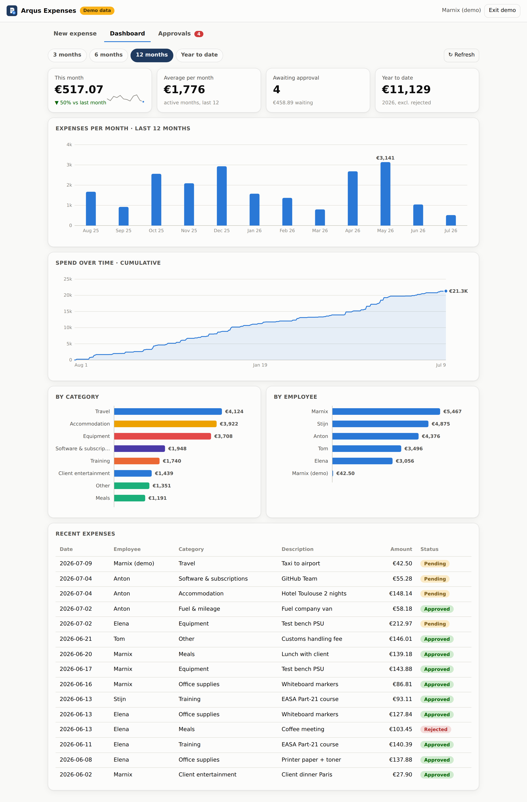
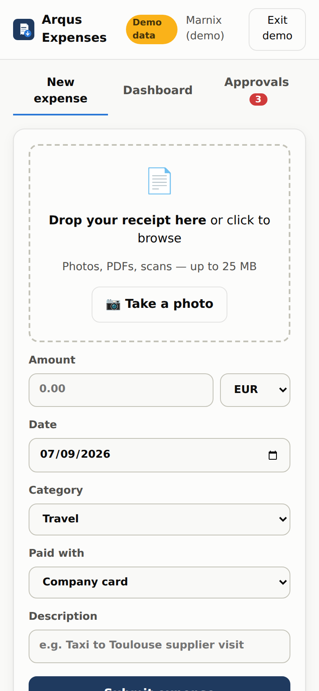

# Arqus Expenses

Snap a picture of a receipt on your phone — or drag & drop a document on your
laptop — and it lands straight in the company SharePoint, gets a row in the
maintained Excel tracker, and waits for approval by Marnix, Stijn or Anton.
A built-in dashboard shows monthly spend, averages, spend over time, category
and per-employee breakdowns.

| Dashboard (light / dark) | Phone |
|---|---|
|  |  |

The app is a static site: it runs on GitHub Pages, needs **no server and no
paid licenses**, and works identically on phones (installable via "Add to
Home Screen") and desktops. Until the Microsoft 365 connection is configured
it runs in **demo mode** with sample data, so you can try every screen today.

---

## The plan: how it connects to SharePoint and Excel

**Chosen architecture: browser → Microsoft Graph API, no middleman.**

```
 Phone / laptop browser (GitHub Pages)
   │  1. access code (1876)                  ── courtesy lock on the UI
   │  2. Microsoft 365 sign-in (MSAL.js)     ── the real security
   ▼
 Microsoft Graph API  (graph.microsoft.com)
   ├─ receipt file  ──► SharePoint ▸ Documents ▸ Expenses ▸ Receipts/<year>/<year-month>/
   └─ expense row   ──► SharePoint ▸ Documents ▸ Expenses ▸ expense-tracker.xlsx
                          └─ Excel table "Expenses" + live Dashboard sheet
```

Every employee signs in with the Microsoft 365 account they already have.
The app then calls Microsoft Graph **as that user** (delegated permissions),
so nobody can do anything through the app they couldn't already do in
SharePoint itself — and there are no shared passwords, API keys or secrets
stored anywhere in the app.

**Why this over the alternatives:**

| Option | Verdict |
|---|---|
| **Browser → Graph API (chosen)** | Zero infrastructure, zero cost, real per-user auth, works from GitHub Pages. |
| Power Automate flow with HTTP trigger | Needs a Premium license per flow, secret URL is shared by everyone, harder to version-control. |
| Power Apps | Per-user licensing, phone UX is heavier, no drag & drop on desktop. |
| Own backend (Azure Function / server) | Works, but adds hosting, secret management and maintenance for no benefit here. |

### The Excel side

The workbook `Documents/Expenses/expense-tracker.xlsx` is **created
automatically the first time anyone submits an expense** (a template is
embedded in the app). It contains:

- **Data** sheet — an Excel table (`Expenses`) the app appends to via the
  Graph Excel API. Dates are written as real Excel dates, amounts as numbers,
  the receipt cell is a clickable link to the file in SharePoint, and the
  Status column is color-coded (Pending / Approved / Rejected).
- **Dashboard** sheet — live formulas (this month, last month, 12-month
  average, year-to-date, pending count), a rolling 12-month block and a
  per-category block, plus two native Excel charts. It recalculates itself
  whenever the app writes a row, so finance can just open the file.

Because it's a plain Excel file in SharePoint you keep full ownership: open
it in Excel/Teams, add sheets, pivot it, feed Power BI from it. The app only
ever touches the `Expenses` table. (Template source: `tools/make_template.py`.)

### The approval step

- Everyone submits; new expenses start as **Pending**.
- Marnix, Stijn and Anton (list in `js/config.js`) get an extra
  **Approvals** tab with a badge showing how many are waiting. One tap on
  Approve/Reject writes Status + who decided + when back into the Excel row.
- Approvers see the receipt link on each card, so they can check the actual
  document before deciding.

### Do we need AI? (assessment)

**Not for v1 — launch without it.** The core flow (photo → SharePoint → Excel
→ approval → dashboard) is deterministic and needs no AI; adding it now would
add cost and a required backend without removing any step.

The one place AI would genuinely help later: **receipt OCR** — prefilling
amount, date and merchant from the photo so employees only confirm instead of
type. Good fit: Azure AI Document Intelligence's prebuilt receipt model
(~€0.01/receipt, free tier of 500 pages/month covers a small team). It can't
be called safely from a static page (the API key would be public), so it
needs a tiny Azure Function in between. Recommendation: run v1 for a month;
if manual entry is the main complaint, add the OCR function as phase 2 —
nothing in the current design has to change for it.

---

## Setup (one time, ~10 minutes, admin account)

### 1. Register the app in Microsoft Entra ID

1. [entra.microsoft.com](https://entra.microsoft.com) → **Identity → Applications → App registrations → New registration**
2. Name: `Arqus Expenses` · Supported account types: **this organization only**
3. Platform: **Single-page application (SPA)** · Redirect URI:
   `https://<your-github-org>.github.io/expenses-app/`
   (add `http://localhost:8123/` too if you want local testing)
4. **API permissions → Add → Microsoft Graph → Delegated**: `User.Read`,
   `Files.ReadWrite.All`, `Sites.ReadWrite.All` → **Grant admin consent**
5. Copy the **Application (client) ID** from the Overview page.

### 2. Configure the app

In [`js/config.js`](js/config.js) set:

- `clientId` — the ID from step 1
- `sitePath` — the SharePoint site to store expenses in (e.g. `/sites/Finance`)
- check `tenant`, `siteHostname`, and the `approvers` list

### 3. Turn on GitHub Pages

Repo **Settings → Pages → Source: GitHub Actions**. Every push to `main`
deploys automatically (`.github/workflows/deploy-pages.yml`).

### 4. First run

Open the Pages URL, enter the access code, sign in with Microsoft. The first
submitted expense auto-creates the `Expenses` folder, the receipts structure
and the workbook. Tell the team to open the site on their phone → browser
menu → **Add to Home Screen** — from then on it behaves like an app.

## Security — read this once

- **The access code (1876) is a courtesy lock, not security.** It lives
  (hashed) in public client-side code and is only 4 digits; treat it as a
  "keep honest people out" filter.
- **Real security is the Microsoft sign-in.** Only accounts in the Arqus
  tenant get in, all writes are audited under the real user, and access can
  be revoked centrally in Entra ID like any other app.
- Approver rights are enforced by the workflow (UI + who's recorded as
  decider), not by SharePoint permissions: anyone with edit rights on the
  site could technically edit the workbook directly in Excel. For a
  small-team internal tool that trade-off is normal; if you ever need hard
  enforcement, move the workbook to a site only approvers can edit.

## Development

```bash
python3 -m http.server 8123      # then open http://localhost:8123
```

No build step, no dependencies. `vendor/msal-browser.min.js` is vendored
(v3.28.1). Demo mode (button on the sign-in screen when `clientId` is empty)
exercises every screen with deterministic sample data.
Regenerate the embedded Excel template after changing columns:
`pip install openpyxl && python3 tools/make_template.py` — it rewrites
`js/xlsx-template.js` in place (keep `COLUMNS` in `js/config.js` in sync).

Layout: `js/app.js` (UI + flow) · `js/graph.js` (SharePoint/Excel via Graph)
· `js/auth.js` (MSAL) · `js/charts.js` (dependency-free SVG charts) ·
`js/stats.js` (aggregations) · `js/config.js` (all settings).
