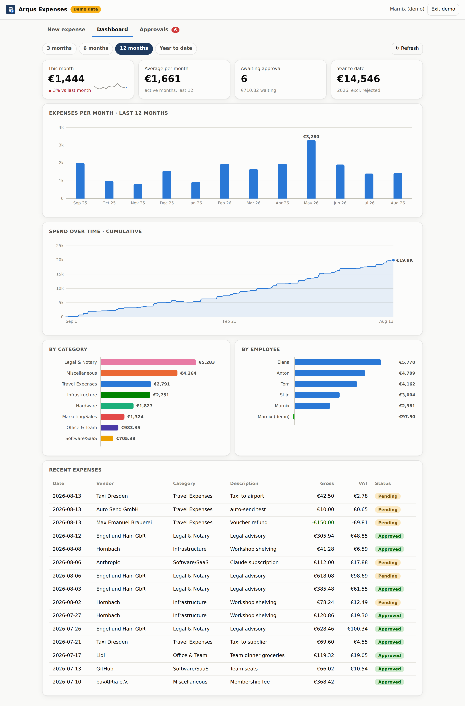
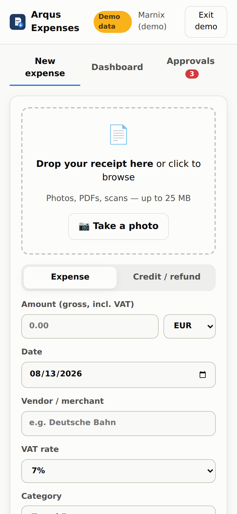

# Arqus Expenses

Snap a picture of a receipt on your phone — or drag & drop a document on your
laptop — and it lands straight in the company SharePoint, gets a row in the
maintained Excel tracker, and waits for approval by Marnix, Stijn or Anton.
A built-in dashboard shows monthly spend, averages, spend over time, category
and per-employee breakdowns.

Before anything is sent, a **review step** shows a summary of what you're about
to submit (gross/net/VAT, vendor, category, receipt) and counts down for
10 seconds — plenty of time to hit "Go back & edit" if something is off.
Amounts are entered gross; the app suggests the VAT rate per category
(19% / 7% / 0%) and computes VAT and net for the books automatically.

**Credits and refunds** are entered as negative amounts: flip the
Expense / Credit toggle, or just type a minus in front of the amount and the
toggle follows. VAT is reversed with the same sign, the row lands negative in
Excel (shown red there, green in the app), and every total, average and chart
nets them off — a month or category that goes negative renders below the
zero line rather than breaking the scale.

| Dashboard (light / dark) | Phone |
|---|---|
|  |  |

The app is a static site: it runs on GitHub Pages, needs **no server and no
paid licenses**, and works identically on phones (installable via "Add to
Home Screen") and desktops. Until the Microsoft 365 connection is configured
it runs in **demo mode** with sample data, so you can try every screen today.

---

## The plan: how it connects to SharePoint and Excel

**Chosen architecture: browser → Microsoft Graph API, no middleman.**

```
 Phone / laptop browser (GitHub Pages)
   │  1. access code (1876)                  ── courtesy lock on the UI
   │  2. Microsoft 365 sign-in (MSAL.js)     ── the real security
   ▼
 Microsoft Graph API  (graph.microsoft.com)
   ├─ receipt file  ──► SharePoint ▸ Documents ▸ Expenses ▸ Receipts/<year>/<year-month>/
   └─ expense row   ──► SharePoint ▸ Documents ▸ Expenses ▸ expense-tracker.xlsx
                          └─ Excel table "Expenses" + live Dashboard sheet
```

Every employee signs in with the Microsoft 365 account they already have.
The app then calls Microsoft Graph **as that user** (delegated permissions),
so nobody can do anything through the app they couldn't already do in
SharePoint itself — and there are no shared passwords, API keys or secrets
stored anywhere in the app.

**Why this over the alternatives:**

| Option | Verdict |
|---|---|
| **Browser → Graph API (chosen)** | Zero infrastructure, zero cost, real per-user auth, works from GitHub Pages. |
| Power Automate flow with HTTP trigger | Needs a Premium license per flow, secret URL is shared by everyone, harder to version-control. |
| Power Apps | Per-user licensing, phone UX is heavier, no drag & drop on desktop. |
| Own backend (Azure Function / server) | Works, but adds hosting, secret management and maintenance for no benefit here. |

### The Excel side

The workbook `Documents/Expenses/expense-tracker.xlsx` is **created
automatically the first time anyone submits an expense** (a template is
embedded in the app). It contains:

- **Data** sheet — an Excel table (`Expenses`) the app appends to via the
  Graph Excel API, with per-expense ID, vendor, gross / VAT-rate / VAT / net,
  payment method and approval status. Dates are written as real Excel dates,
  the receipt cell is a clickable link to the file in SharePoint, and the
  Status column is color-coded (Pending / Approved / Rejected). The template
  ships **pre-seeded with the imported June/July 2026 expenses**
  (RE-001 … RE-018, €2,785.45 gross / €293.92 VAT) — rows that were
  "Ready for Accountant" are marked Approved, the rest arrive as Pending so
  they can be approved in the app.
- **Dashboard** sheet — live formulas (this month, last month, 12-month
  average, year-to-date, pending count), a rolling 12-month block and a
  per-category block, plus two native Excel charts. It recalculates itself
  whenever the app writes a row, so finance can just open the file.

Because it's a plain Excel file in SharePoint you keep full ownership: open
it in Excel/Teams, add sheets, pivot it, feed Power BI from it. The app only
ever touches the `Expenses` table. (Template source: `tools/make_template.py`.)

### Who may file, who may approve

- **Filing is open to the whole company — and to nobody else.** Anyone with an
  Arqus Microsoft 365 account can submit expenses; no per-person setup, no
  invitations to maintain. After sign-in the app checks the account against
  `tenantId` and `allowedEmailDomains` in `js/config.js`: an account from
  another directory, a personal Microsoft account, or a guest invited into the
  tenant is refused on the spot, before any Graph call is made, and sees a
  "this app is for Arqus accounts only" card instead of the app.
- **Approving is limited to the three founders** — Marnix, Stijn and Anton,
  the `approvers` list in `js/config.js`. They see the company-wide
  **Dashboard** and the **Approvals** tab with a badge showing how many
  expenses are waiting. One tap on Approve/Reject writes Status + who decided
  + when back into the Excel row, with the receipt link on each card for
  checking the actual document. Approver rights are checked on the call that
  writes the decision, not just by hiding the tab, so a non-approver poking
  around in the browser console gets an error rather than a decided row.
- **Everyone else** doesn't get the company dashboard at all. Instead they
  get **My expenses**: a personal record of everything they have filed
  (date, vendor, amounts, approval status, receipt link) plus their own
  monthly/yearly totals — and nothing about anyone else's spending.
- Everyone submits; new expenses start as **Pending**.

Preview each case without signing in: `?demo=1` (founder view),
`?demo=employee` (restricted view) or `?demo=outsider` (refused account).

### Do we need AI? (assessment)

**Not for v1 — launch without it.** The core flow (photo → SharePoint → Excel
→ approval → dashboard) is deterministic and needs no AI; adding it now would
add cost and a required backend without removing any step.

The one place AI would genuinely help later: **receipt OCR** — prefilling
amount, date and merchant from the photo so employees only confirm instead of
type. Good fit: Azure AI Document Intelligence's prebuilt receipt model
(~€0.01/receipt, free tier of 500 pages/month covers a small team). It can't
be called safely from a static page (the API key would be public), so it
needs a tiny Azure Function in between. Recommendation: run v1 for a month;
if manual entry is the main complaint, add the OCR function as phase 2 —
nothing in the current design has to change for it.

---

## Setup (one time, ~10 minutes, admin account)

### 1. Register the app in Microsoft Entra ID

1. [entra.microsoft.com](https://entra.microsoft.com) → **Identity → Applications → App registrations → New registration**
2. Name: `Arqus Expenses` · Supported account types: **this organization only**
3. Platform: **Single-page application (SPA)** · Redirect URI:
   `https://<your-github-org>.github.io/expenses-app/`
   (add `http://localhost:8123/` too if you want local testing)
4. **API permissions → Add → Microsoft Graph → Delegated**: `User.Read`,
   `Files.ReadWrite.All`, `Sites.ReadWrite.All` → **Grant admin consent**
5. Copy the **Application (client) ID** from the Overview page.

### 2. Configure the app

In [`js/config.js`](js/config.js) set:

- `clientId` — the ID from step 1
- `sitePath` — the SharePoint site to store expenses in (e.g. `/sites/Finance`)
- check `tenant`, `siteHostname`, and the `approvers` list
- `tenantId` + `allowedEmailDomains` — who may use the app at all (see
  "Who may file, who may approve"). `tenantId` is the **Directory (tenant) ID**
  from the Entra ID Overview page; for Arqus it is already filled in. Leaving
  it `""` falls back to the domain check alone.

### 3. Turn on GitHub Pages

Repo **Settings → Pages → Source: GitHub Actions**. Every push to `main`
deploys automatically (`.github/workflows/deploy-pages.yml`).

### 4. First run

Open the Pages URL, enter the access code, sign in with Microsoft. The first
submitted expense auto-creates the `Expenses` folder, the receipts structure
and the workbook. Tell the team to open the site on their phone → browser
menu → **Add to Home Screen** — from then on it behaves like an app.

### "Access denied" when someone submits

The app writes to SharePoint **as the signed-in user**, so filing an expense
requires that person to have edit rights on the site named by `sitePath`
(`/sites/Finance`). Founders own that site; an employee who was never added to
it signs in fine and then gets a 403 from Graph on the first write.

The fix is a SharePoint grant, not a code change: add the team to the site's
**Members** group (site → gear → *Site permissions* → *Add members*; on a
group-connected site, add them to the Microsoft 365 group). A missing
SharePoint license on the account produces the same 403.

The app tells people this itself rather than passing Graph's bare "Access
denied" through: it checks the library once when the app opens and shows a
banner above the form (with the Graph error code in small print for whoever
is debugging), so nobody types a whole expense before finding out.

## Security — read this once

- **The access code (1876) is a courtesy lock, not security.** It lives
  (hashed) in public client-side code and is only 4 digits; treat it as a
  "keep honest people out" filter.
- **Real security is the Microsoft sign-in.** Only accounts in the Arqus
  tenant get in, all writes are audited under the real user, and access can
  be revoked centrally in Entra ID like any other app. On top of the
  single-tenant app registration the app verifies the signed-in account's
  `tid` claim and address domain itself, so a guest account invited into the
  tenant — or any account from elsewhere — is refused even if the
  registration is later loosened.
- Role separation (founder dashboard vs personal list) and approver rights
  are enforced **in the app's UI**, not by SharePoint permissions. Because
  employees write rows to the workbook as themselves, they necessarily have
  edit rights on it — so a technically savvy employee could bypass the app
  and open the workbook directly in SharePoint. For a small-team internal
  tool that trade-off is normal; hard enforcement would require a small
  server (e.g. an Azure Function) between the app and SharePoint, which can
  be added later without changing the app's flow.

## Development

```bash
python3 -m http.server 8123      # then open http://localhost:8123
```

No build step, no dependencies. `vendor/msal-browser.min.js` is vendored
(v3.28.1). Demo mode (button on the sign-in screen when `clientId` is empty)
exercises every screen with deterministic sample data.
Regenerate the embedded Excel template after changing columns:
`pip install openpyxl && python3 tools/make_template.py` — it rewrites
`js/xlsx-template.js` in place (keep `COLUMNS` in `js/config.js` in sync).

Regression suite — drives the real UI (gate, submit, review/undo, credits and
their approval, dashboard charts, approvals, employee role, and the
file/approve permission rules incl. a refused non-company account) and fails
on any console error:

```bash
python3 -m http.server 8123 &
npm i playwright && node tools/e2e.mjs      # screenshots in .screenshots/
```

`tools/chart-negatives.html` is a visual harness for the charts' negative-value
handling (net-credit months, all-negative, zero-crossing line, empty data) —
open it via the local server after touching `js/charts.js`.

Layout: `js/app.js` (UI + flow) · `js/graph.js` (SharePoint/Excel via Graph)
· `js/auth.js` (MSAL) · `js/charts.js` (dependency-free SVG charts) ·
`js/stats.js` (aggregations) · `js/config.js` (all settings).
